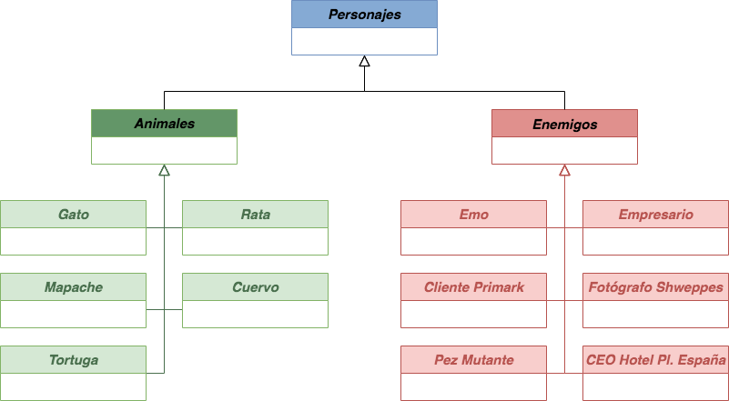

<h1> Madrid o Libertad</h1>

https://beleen3103.github.io/DVI_Gatetes/

<h2>Genero</h2>

Plataformas con desplazamiento horizontal y combate por turnos

<h2>Plataforma</h2>

Página web desarrollado con Phaser

<h2>PEGI</h2>

+18

<h2>Lore</h2>
<h3><i>Personajes principales</i></h3>
<ul>
  <li>Gato</li>
  <li>Mapache</li>
  <li>Rata</li>
  <li>Cuervo</li>
  <li>Tortuga</li>
</ul>

<h3><i>Enemigos</i></h3>
<ul>
  <li>Emos</li>
  <li>Cliente del Primark</li>
  <li>Fotógrafos Shweppes</li>
  <li>Peces mutantes de alcantarilla</li>
  <li>Empresarios</li>
  <li>CEO Hotel Plaza España</li>
</ul>

<h3><i>Desarrollo de la historia</i></h3>
La historia principal se centra en un gatete que vivía en Plaza España. Este estaba feliz viviendo en ella hasta que se realizaron las obras de remodelación de la plaza, haciendo que perdiera su casa y comfort. Tras esto decide embarcar un viaje tratando de escapar de Madrid, en el que tendrá que superar varios enemigos humanos que se lo impedirán. En su viaje, se encontrará con otros animales compañeros que se le unirán a su aventura en búsqueda de la libertad en un lugar mejor.
  
El juego tiene una historia principal lineal, en la que el jugador va pasando por diferentes zonas de Madrid tratando de salir de la capital. En cada zona se desbloqueará un personaje que se podrá usar en cualquier momento tanto para ir por el mundo como para combatir contra enemigos.
  
En cierto punto de la historia, se desbloquea la zona de alcantarillas que sirve como "HUB". Desde este punto se podrá avanzar por la historia o volver a otras zonas que ya se hayan pasado para, por ejemplo: volver a pelear con enemigos o conseguir nuevos objetos.
 

<h4>Zona 0 (Tutorial) - Plaza España</h4>
La zona de Plaza España nos servirá como zona inicial del juego y como tutorial de las primeras mecánicas básicas:
<ul>
  <li><i>Moverse lateralmente</i></li>
  <li><i>Saltar</i></li>
  <li><i>Combatir contra enemigos</i></li>
</ul>
Esta zona solo será jugable con el personaje del gato, que es el principal de la historia.
No descartamos meter algo para que el jugador pueda volver para acceder a una subzona con otro personaje una vez desbloqueado (por ejemplo, las basuras donde rebuscar con el Mapache).

<h4>Zona 1 - Gran vía</h4>
Tras pasar el tutorial de movimiento y de combate de Plaza España, se cambiará de escena a Gran Vía, que se caracteriza por tener disponible dos ramas de juego: saltar y moverse mediante plataformeo evitando los combates con enemigos; o bien pelear mientras se avanza en la historia.
  
Al momento de llegar delante del Edificio de Shweppes, hay un evento obligatorio, en el que ayudaremos al mapache a escapar de una sesión fotográfica que le están realizando unos fotógrafos para un anuncio delante del edificio.
  
Tras el evento se desbloquea al personaje del Mapache y se le enseña al jugador a cómo rotar de personaje en cualquier momento.
  
Se sigue avanzando hasta el final de Gran Vía, donde el jugador se encontrará frente un control policial. El jugador puede elegir ir por las alcantarillas para proseguir con la historia, o pelear contra la policía liderada por un perro llamado Perro Sanxe y ser brutalmente asesinado.

<h4>Zona 2 - Alcantarillado (HUB)</h4>
<i>por rellenar...</i>

<h4>Zona 3 - Cuatro Torres</h4>
<i>por rellenar...</i>

<h4>Zona 4 - Atocha - Retiro</h4>
<i>por rellenar...</i>

<h2>Contexto</h2>

<h2>Mecánicas</h2>
<ul>
  <li>Movimiento Lateral</li>
  <li>Salto</li>
  <li>Salto de pared</li>
  <li>Agacharse</li>
  <li>Combatir (por turnos)</li>
  <li>Escalar pared <i><b>(Gato)</b></i></li>
  <li>Rebuscar en la basura <i><b>(Mapache)</b></i></li>
  <li>Doble Salto <i><b>(Mapache)</b></i></li>
  <li>Meterse en agujeros <i><b>(Rata)</b></i></li>
  <li>Planear <i><b>(Cuervo)</b></i></li>
  <li>Nadar <i><b>(Tortuga)</b></i></li>
</ul>

<h2>Dinámicas</h2>

<h2>Controles</h2>
<ul>
  <li><b>"AD"</b>: Desplazamiento horizontal</li>
  <li><b>"W" o "Barra espaciadora"</b>: salto</li>
  <li><b>"E"</b>: Cambio de personaje</li>
</ul>

<h2>Dirección Artística</h2>
<h3><i>Arte gráfico</i></h3>
<i>por completar ...</i>

<h3><i>Banda Sonora</i></h3>
La Banda Sonora del juego se basa en leitmotivs y se caracteriza por el uso de sonidos orgánicos, cercanos y cotidianos.
  
En cada zona además la música se adecúa al contexto, como por ejemplo un aumento en la reverberación al estar dentro de las alcantarillas.
  
Hay un leitmotiv por personaje que empieza a sonar cuando se empieza a usar (el jugador puede decidir cambiar de personaje en cualquier instante del juego.
  
La lista de tracks es la siguiente:
<ul>
  <li><i><b>Cat's will:</b> leitmotiv del Gato</i></li>
  <li><i><b>Overpowered Raccoon:</b> leitmotiv del Mapache</i></li>
  <li><i><b>Legionnaire Rat:</b> leitmotiv de la Rata</i></li>
  <li><i><b>Bard Raven:</b> leitmotiv del Cuervo</i></li>
  <li><i><b>Tortoise the Shoe Fetishist:</b> leitmotiv de la Tortuga</i></li>
  <li><i><b>Compulsive Deceiver:</b> leitmotive de Perro Sanxe</i></li>
  <li><i><b>Eren's freedom:</b> música de combate</i></li>
  <li><i><b>A Seagull's Dream:</b> despedida de Madrid</i></li>
</ul>

<h2>Arquitectura</h2>
Diseño UML de las clases

<h2>Sistema</h2>

