<h1> Miaudrid o Libertad</h1>

https://beleen3103.github.io/DVI_Gatetes/

<b>Grupo: </b>DVI Gatetes

<h2>Datos Generales</h2>
<b>Género: </b><i>Plataformas</i> 
<b>Plataforma: </b><i>PC (navegador web)</i> 
<b>PEGI: </b><i>12</i> 
<b>Público objetivo: </b><i>Joven-Adulto</i> 

<h3>Sinopsis</h3>

Miaudrid o Libertad es un juego ambientado en la ciudad de Madrid actual en el año 2022. El personaje controlado por el jugador sin embargo no es un humano sino un gato, este se ve rodeado de las obras hechas por los humanos y cansado luchará contra estos para huir de la ciudad y encontrar zonas más verdes rodeadas de naturaleza. 

Empieza en Plaza España emprendiendo su aventura por Gran Vía hasta encontrar un simpático mapache que le pide ayuda, a partir de aquí nuestro protagonista no tendrá que ir solo por la ciudad y poco a poco le irán ayudando más animales conforme también los humanos irán haciendo más difícil su huída.

El juego tiene un tono de comedia junto con cierta crítica a cómo el ser humano ha invadido cada vez más espacios naturales acabando con el bienestar de muchos animales.

Los humanos que aparecen en el juego son todos caricaturas de alguna persona característica que estaría en la zona, como en Plaza España los “emos” o en Gran Vía los heavys. Todo esto acompañado con un arte despreocupado acorde con el tono del juego.

<h2>Gameplay</h2>
<h3>Contexto</h3>

El juego se basa en un Madrid actual. Con la iniciativa que está tomando la ciudad de remodelar zonas verdes como Plaza de España para asfaltarlas, se están perdiendo lentamente los parques de Madrid. Con esto, la fauna se ve expulsada de sus territorios.

<h3>Historia</h3>

  Las obras de Madrid han llevado a un Gato a querer huir de su hábitat en Plaza España para irse lejos a zonas más verdes y lejos de los humanos y piensa acabar con cualquier humano que se lo quiera impedir. Por su ruta huyendo de Madrid se encontrará con otros animales que por unas razones u otras se le van a unir en su aventura. Al conocer nuevos compañeros irá conociendo más y más maldades de los seres humanos alimentando su sed de venganza y su afán por una vida lejos de ellos.

La historia se sitúa inicialmente en Plaza España, que nos sirve de zona de tutorial de movimiento (se le presenta al jugador cómo mover lateralmente al personaje y cómo saltar), para posteriormente realizar el primer combate por turnos.

Una vez terminado con el tutorial, el jugador puede avanzar hasta la zona de Gran Vía. En este momento se presenta la habilidad de trepar por enredaderas, exclusiva del Gato (otros personajes desbloqueados en el futuro no podrán escalar). Con esta nueva mecánica se le presenta al jugador dos alternativas para pasarse el nivel e ir a la siguiente zona:
<ul>
  <li><b>Plataformeo: </b>usar los diferentes tipos de plataformas para evitar los combates. Hay otros elementos que intentarán entorpecer al jugador para que se caiga y entre en combate, o simplemente quitarle vida.</li>
  <li><b>Combates consecutivos: </b>Realizar los combates uno detrás de otro hasta derrotar a todos los enemigos de la zona</li>
</ul>

Sea cual sea el camino elegido (o una combinación de ambas), el Gato entra a la zona de Callao, donde un Mapache está siendo acorralado por un grupo de emos que le están haciendo fotos. Ante esta situación, el Mapache le pide ayuda al Gato para escapar. El Gato acepta y el jugado entra en combate contra los emos, esta vez pudiendo controlar a ambos personajes (Gato y Mapache). Una vez concluido el combate, el Mapache se une al equipo para que pueda ser usado tanto en plataformeo como en conjunto con el Gato en futuros combates.

Tras el combate, el Mapache sugiere escapar por las alcantarillas para evitar que el resto de humanos se les echen encima. Al entrar en la nueva zona se encuentran con el tercer personaje jugable del juego: la Rata. Esta misma, al verlos, les explica que efectivamente los humanos han empezado a agredir a todos los animales que se encuentran en Gran Vía y Callao, incluyendo compañeras suyas, causándole rabia y ansias de venganza. Por esa misma razón, se une al equipo para que juntos puedan ir a derrotar al grupo de humanos que está causando problemas.

Antes de salir de la alcantarilla, la Rata les comenta que pueden usar unas cajas de cartón con latas de comida para descansar y curarse, a modo de preparación. Además, las alcantarillas les servirán a modo de central por la que poder llegar a otros sitios de Madrid más adelante.

Para salir de las Alcantarillas, se podrá usar a la Rata, que es de un tamaño más reducido, permitiéndoles pasar por lugares más estrechos.

Al salir de la alcantarilla, el jugador puede volver a cualquier zona anterior, aunque de momento no hay implementada ninguna otra zona. Al seguir hacia la derecha de Callao se presentará el mensaje de final de demo al jugador.

<h3>Personajes Jugables</h3>

Todos los personajes empiezan con 100 de vida, y cuentan con 3 ataques cada uno para los combates.

<h4>Gato</h4>

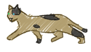

Primer personaje jugable del juego. Al estar enfadado tras ver que los humanos cada vez le quitan más y más vegetación, es quien comienza la aventura decidiendo marcharse de su hogar, Plaza de España, en busca de algo de naturaleza.

<table>
  <tr>
    <th>ID Ataque</th>
    <th>Efecto</th>
    <th>Objetivo</th>
  </tr>
  <tr>
    <td>Zarpazo</td>
    <td>-10 de vida</td>
    <td>Enemigo objetivo</td>
  </tr>
  <tr>
    <td>Afilar</td>
    <td>+10 de vida</td>
    <td>Uno mismo</td>
  </tr>
  <tr>
    <td>Sangrado</td>
    <td>-25 de vida</td>
    <td>Enemigo objetivo</td>
  </tr>
</table>

<h4>Mapache</h4>

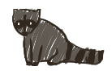

Un mapache que es acosado en Gran Vía por algunos emos. Pertenece a la generación de mapaches que infestó Madrid en los dos mil. Tras ayudarle, decide devolvernos el favor uniéndose a nuestro equipo. Le gusta rebuscar en la basura en busca de tesoros del mundo humano.

<table>
  <tr>
    <th>ID Ataque</th>
    <th>Efecto</th>
    <th>Objetivo</th>
  </tr>
  <tr>
    <td>Mordisco</td>
    <td>-25 de vida</td>
    <td>Enemigo objetivo</td>
  </tr>
  <tr>
    <td>Basura</td>
    <td>+10 de vida</td>
    <td>Uno mismo</td>
  </tr>
  <tr>
    <td>Coletazo</td>
    <td>-10 de vida</td>
    <td>Todos los enemigos</td>
  </tr>
</table>

<h4>Rata</h4>

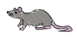

Una agradable ratilla que vive en las alcantarillas. Cansada de estar por allí, decide unirse al equipo en busca de un poco de acción y, quizás, corromper el mundo humano lo suficiente como para hacer de éste su hogar.

<table>
  <tr>
    <th>ID Ataque</th>
    <th>Efecto</th>
    <th>Objetivo</th>
  </tr>
  <tr>
    <td>Mordisco</td>
    <td>-15 de vida</td>
    <td>Enemigo objetivo</td>
  </tr>
  <tr>
    <td>Basura</td>
    <td>+10 de vida</td>
    <td>Uno mismo</td>
  </tr>
  <tr>
    <td>Coletazo</td>
    <td>3 ataques -10 de vida</td>
    <td>Enemigos objetivos</td>
  </tr>
</table>

<h3>Enemigos</h3>

Todos los enemigos empiezan con 100 de vida, y cuentan con 3 ataques cada uno para los combates. Todos los enemigos tienen un 20% de posibilidades de fallar sus ataques.

A la hora de combatir, también tienen un conjunto de ataques que, en este caso, al ser controlados por la IA del juego, cuentan con dos variables extra para ayudar a decidir cuándo se debe usar cada uno. El primero de todos es la cantidad de turnos de espera hasta que se pueda volver a usar el mismo ataque, y la prioridad dentro de la lista de ataques disponibles. Siempre intentará usar el ataque de más prioridad frente al resto, a no ser que se encuentre en espera para volver a ser usado.

<h4>Emos</h4>

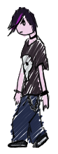

Sin nada más que hacer en su día, los emos se dedican a pasear por Plaza de España o Gran Vía en busca de algún entretenimiento. Sin duda, no perderán la oportunidad de interactuar con los pequeños animales que dan vueltas por la ciudad.

El emo solo se moverá en el mapa realizando un movimiento repetido de un lado a otro.

<table>
  <tr>
    <th>ID Ataque</th>
    <th>Efecto</th>
    <th>Objetivo</th>
    <th>Turnos de espera</th>
    <th>Prioridad</th>
  </tr>
  <tr>
    <td>Ataque1</td>
    <td>-5 de vida</td>
    <td>Todos los enemigos</td>
    <td>1</td>
    <td>Baja</td>
  </tr>
  <tr>
    <td>Ataque2</td>
    <td>+10 de vida</td>
    <td>Todos los aliados</td>
    <td>2</td>
    <td>Media</td>
  </tr>
  <tr>
    <td>Ataque3</td>
    <td>-15 de vida</td>
    <td>Enemigo objetivo</td>
    <td>3</td>
    <td>Alta</td>
  </tr>
</table>

<h4>Rockero</h4>

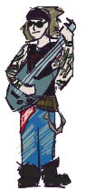

En honor a los famosos heavys de Gran Vía, este rockero dedica sus días a tocar para los transeúntes en la calle más famosa de Madrid. Sin embargo, su música no es para todos los oídos, hay quien puede quedarse un poco atontado ante tal estridente sonido.

Además el Rockero en el mapa pese a estar estático estará tocando su guitarra lanzando notas al aire que si le dan a nuestro animal le atraerán hacia el suelo instantáneamente.

<table>
  <tr>
    <th>ID Ataque</th>
    <th>Efecto</th>
    <th>Objetivo</th>
    <th>Turnos de espera</th>
    <th>Prioridad</th>
  </tr>
  <tr>
    <td>Ataque1</td>
    <td>-4 de vida</td>
    <td>Todos los enemigos</td>
    <td>1</td>
    <td>Baja</td>
  </tr>
  <tr>
    <td>Ataque2</td>
    <td>-0 de vida y quitarle un turno</td>
    <td>Enemigo objetivo</td>
    <td>2</td>
    <td>Media</td>
  </tr>
  <tr>
    <td>Ataque3</td>
    <td>-15 de vida</td>
    <td>Enemigo objetivo</td>
    <td>3</td>
    <td>Alta</td>
  </tr>
</table>

<h4>Dron</h4>

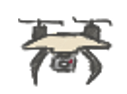

Un pequeño dron de vigilancia que sobrevuela Gran Vía a la espera de detectar cualquier tipo de altercado o de comportamiento fuera de lo normal. No temerá en acercarse a inspeccionar más de cerca.

El dron no hace daño en combate sino que perseguirá al animal en su radio de influencia y al chocar en el mapa hará 5 de daño destruyéndose.

<h2>Mecánicas</h2>

Para el juego hemos querido crear diferentes tipos de mecánicas tanto para las plataformas como para los combates

<h3>Plataformas</h3>

En cuanto a las plataformas en sí hemos creado 5 tipos de plataformas de los cuales hemos terminado implementando 3, estas plataformas son:
  <ul>
    <li><b>Plataformas sólidas: </b>no tienen nada especial si chocas con ellas no te dejan pasar y puedes estar encima de ellas.</li>
    <li><b>Plataformas con rebote: </b>en ellas al estar encima hacen que el personaje continuamente esté saltando más alto de lo que haría de normal, permitiendo hacer saltos más largos aunque obligando al usuario a estar continuamente en salto haciendo que pueda complicarse calcular bien el mismo.</li>
    <li><b>Zonas de escalada </b>en ellas el personaje “Gato” puede moverse verticalmente permitiendo acceder con este a zonas más elevadas. Además para evitar que caiga automáticamente al no estar escalando la velocidad de caída en las mismas ha sido reducida.</li>
  </ul>

Los animales además cada uno puede interactuar de una forma distinta con las plataformas: 
  <ul>
    <li>El gato puede trepar por las zonas indicadas.</li>
    <li>El mapache puede rebuscar en basuras</li>
    <li>La rata es más pequeña por lo que cabe por zonas estrechas</li>
  </ul>
  
Además los distintos enemigos también tienen comportamientos distintos en el mapa:
  <ul>
    <li>El emo se mueve de un lado a otro en una zona específica para chocar contra nuestro personaje.</li>
    <li>El rockero está estático pero lanza notas musicales verticalmente que hacen que nuestro personaje caiga rápidamente.</li>
    <li>El dron tiene una zona en la que al entrar con el personaje lo busca e intentará chocar contra él haciéndo 5 de daño al mismo.</li>
  </ul>

<h3>Combate</h3>

Para el combate las mecánicas principales que hemos desarrollado son:
  <ul>
    <li>El combate por turnos, primero van todos los animales y luego los enemigos.</li>
    <li>Ataques que dañan a un solo objetivo seleccionado.</li>
    <li>Ataques que hacen daño a todos los enemigos.</li>
    <li>Ataques que paralizan a un enemigo durante un turno.</li>
    <li>Curaciones en uno mismo y en área.</li>
    <li>Múltiples ataques que se pueden repartir entre varios enemigos.</li>
    <li>Posibilidad de fallar ataques en los enemigos.</li>
    <li>Prioridad en el uso de ataques de los enemigos.</li>
  </ul>
Todas estas mecánicas combinadas forman un combate por turnos que se hace complicado pero entretenido una vez entendidas las mecánicas y comportamientos.

<h2>Dinámicas</h2>

Con todas las mecánicas expuestas anteriormente se consiguen distintos tipos de dinámicas:
  <ul>
    <li>El plataformeo permite que el usuario quiera intentar ir por la zona de arriba pese a poder ser complicada de pasar para poder evitar los combates en el suelo para no perder vida. </li>
    <li>Además en el plataformeo se construyen dinámicas de tener que saber qué animal utilizar según la situación y querer conseguir animales nuevos para poder solventar posibles situaciones imposibles de cruzar sin ellos.</li>
    <li>En combate se consiguen mecánicas con la prioridad de ataques del enemigo que llevan al usuario a saber decidir si quieren realizar un ataque u otro, para curarse, hacer más daño o intentar hacer daño a todos los enemigos.</li>
    <li>Además en combate con la combinación de distintos tipos de enemigo o distintos tipos de animales se generan dinámicas de combate que pueden llegar a hacer “combo” como un rockero paralizando al enemigo mientras un emo ataca.</li>
  </ul>

<h2>Arte</h2>
<h3>Gráficos</h3>

Todo el arte del juego ha sido creado para el mismo.

Hemos buscado un estilo artístico que fuese sencillo pero a la vez llamativo, para ello al final damos con un estilo ‘descuidado’, cartoon, dando sensación de boceto o garabato, ya que nos parecía adecuado para el tono del juego con cierto toque de humor y no demasiado serio.

Sin embargo, pese a buscar un estilo divertido los mapas de la ciudad tienen una paleta de color más apagada y con colores grisáceos, para remarcar el aura de decadencia que se debe a los humanos.

Estos mapas son todos basados en zonas reales de Madrid modificadas para mantener coherencia en el plataformeo del juego.
  

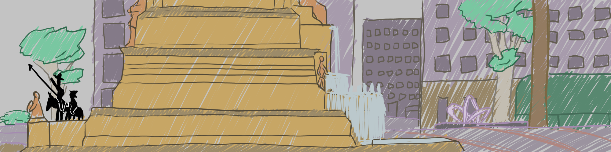 
Plaza España

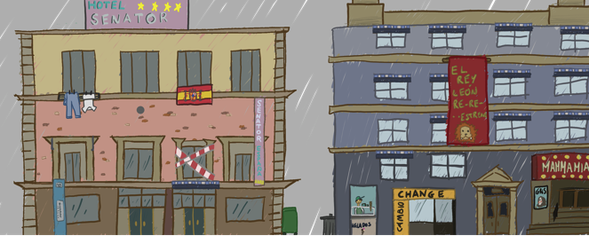 
Gran Vía

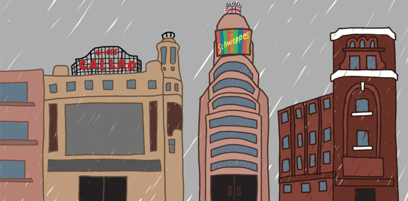 
Callao

  
En las alcantarillas optamos por una paleta de colores complementarios con el verde como color dominante con toques naranjas como en las tuberías.

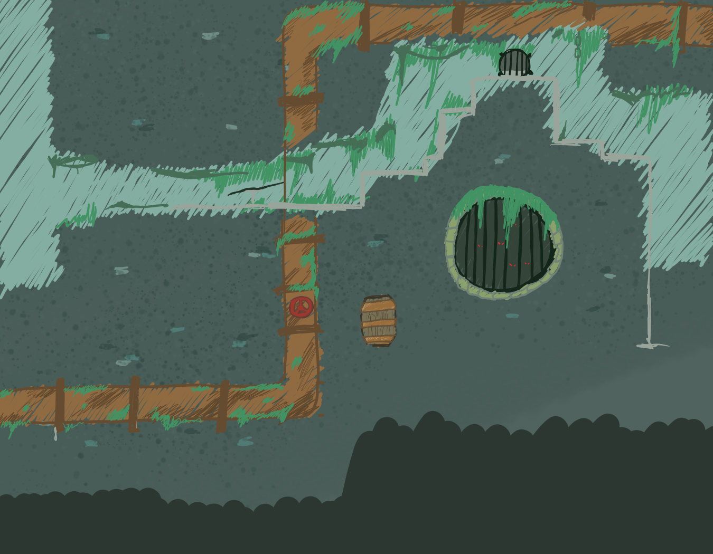 
Alcantarilla

  
Para el mapa de batalla de momento solo se ha hecho el de la batalla en ciudad, siendo un fondo estándar que puede asociarse fácilmente a cualquier combate en zonas de ciudad. Sin demasiado detalle para no distraer de la acción.

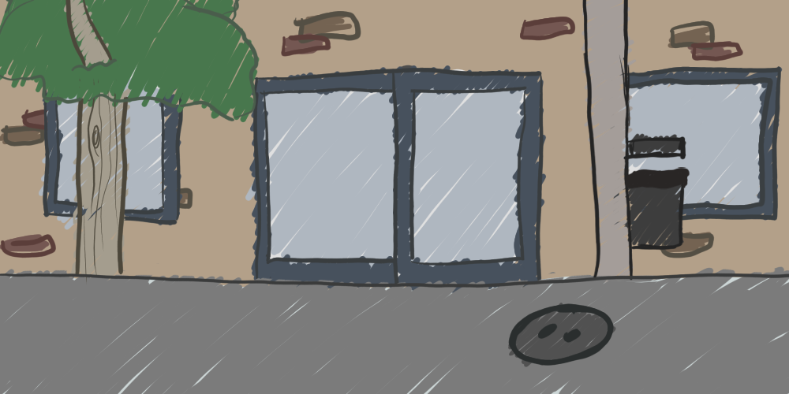 
Plaza España

  
Para los personajes y demás sprites el estilo de garabato permite que en las animaciones haya una mayor sensación de movimiento aunque las animaciones sean de 6 frames cada una. Además se ha mantenido una coherencia de estilo junto con el fondo y el resto de personajes, siendo todos los humanos con una forma y tamaño similar pese a los distintivos propios de cada personaje. 

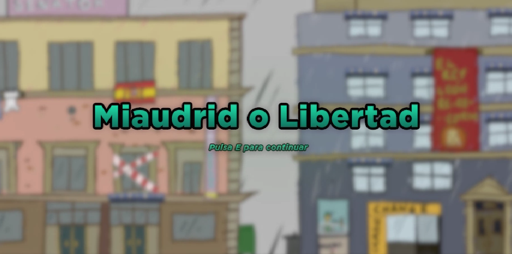 
Pantalla de inicio

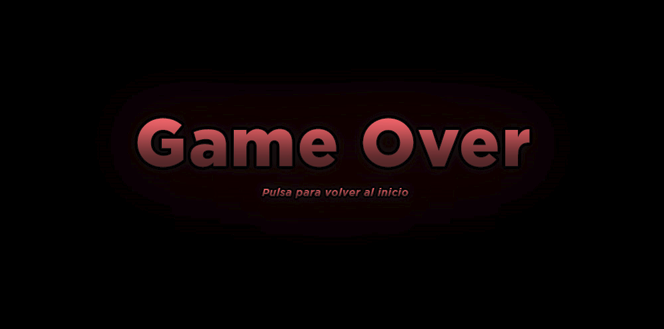 
Game Over

<h3>Música</h3>

Toda la música del juego ha sido creada únicamente para el mismo, teniendo en cuenta los elementos de la historia y estilo de arte gráfico.
  
Queríamos que la música destacara sobre el arte gráfico, que era de un estilo más cartoon, basado en garabatos. En contraposición a esto, para mostrar el ansia de libertad y venganza del personaje principal, los diferentes temas de los escenarios son frenéticos, con la percusión muy marcada y con bpm altos (114 hasta 220).
  
Los temas pertenecen al synth-pop, un género basado en los sintetizadores para las progresiones de acordes y bases de la armonía. Además todos los temas están muy influenciados por temas de series de anime japonés, sobre todo en sus progresiones de acordes.

También, para que todos los temas tuvieran más cohesión entre sí, los sintetizadores que realizan las melodías de los temas son siempre los mismos con pequeñas variaciones de ecualización para integrarlas en las diferentes bases rítmicas.

Un aspecto muy importante en todos los temas de escenarios (en contraposición al tema de combate) es que todos se basan en una progresión de acordes que se repite en loop, para que sea más fácil acostumbrarte al loop constante de la canción mientras el jugador se encuentra en un escenario concreto.

Esta son la lista de temas que se han realizado:
  <ul>
    <li><b>Tema de inicio / tutorial: </b>armónicamente es idéntico al tema de Gran Vía, con la excepción de que únicamente suenan dos pistas de audio del total <i>(pad de acordes y lead melódico)</i>. Se decidió así para que sirviera de introducción al estilo musical y para que se entendiera que el tutorial realmente es una preparatoria de lo que realmente sería el primer nivel como es Gran Vía</li>
    <li><b>Tema de Gran Vía: </b>loop de acordes con varios instrumentos <i>(la mayoría electrónicos)</i> como batería, bajo, arpegiadores, pads, keys y un lead <i>(melodía)</i></li>
    <li><b>Tema de Callao: </b>loop de acordes con muchos elementos parecidos o directamente iguales al tema de Gran Vía, de nuevo para no generar demasiado contraste debido a que se llega a Callao desde dicha zona.</li>
    <li><b>Tema de la Alcantarilla: </b>es el más diferente de las otras zonas, empezando por una pequeña introducción con un efecto de lejanía, que ayuda a entender que la zona es subterránea y no tiene nada que ver con las anteriores. La base musical es la misma: un loop con una melodía cambiante. En este caso, la base rítmica y pista de vientos está más influenciada por música alternativa / rock de grupos como <i>La Fúmiga, Zoo, Oques Grasses (por ejemplo, Ja no fa mal - La Fúmiga)</i></li>
    <li><b>Tema de Combate: </b>este tema se separa más del resto en la estructura armónica, ya que no es un loop constante de acordes, sino una progresión única. Es el tema que más parece una canción convencional. Aun así, los elementos e instrumentos son los mismos o muy parecidos a los otros temas para que cohesionen. Está muy influenciado por openings de anime japonés, en concreto de <i>“Shinzo wo Sasageyo! - Linked Horizon” </i>de la serie de Attack on Titan, por hacer una referencia a la saga.</li>
  </ul>

<h2>Controles</h2>

Decidimos que únicamente se pudiera jugar a nuestro juego mediante teclado y ratón, ya que debido a las mecánicas que habíamos elegido implementar. También tomamos como referencia controles de otros juegos de plataformas y combate para mantener consistencia externa y que el jugador no sienta que los controles son extraños.

Para hacer los controles lo más sencillo posible, los separamos entre controles del modo plataformas y controles del modo combate:

<h3>Controles del modo plataformas</h3>

  <ul>
    <li><b>A: </b>movimiento lateral hacia la izquierda</li>
    <li><b>D: </b>movimiento lateral hacia la derecha</li>
    <li><b>W o Espacio: </b>saltar</li>
    <li><b>E: </b>aceptar / entrar a un evento / mostrar siguiente diálogo</li>
    <li><b>1: </b>usar al Gato</li>
    <li><b>2: </b>usar al Mapache</li>
    <li><b>3: </b>usar a la Rata</li>
  </ul>

<h3>Controles del modo combate</h3>

  <ul>
    <li><b>Click izquierdo: </b>usar al Mapache</li>
    <li><b>Mov. ratón: </b>puntero de selección (ataque y enemigo)<li>
  </ul>

<h2>Arquitectura</h2>
Diseño UML
  

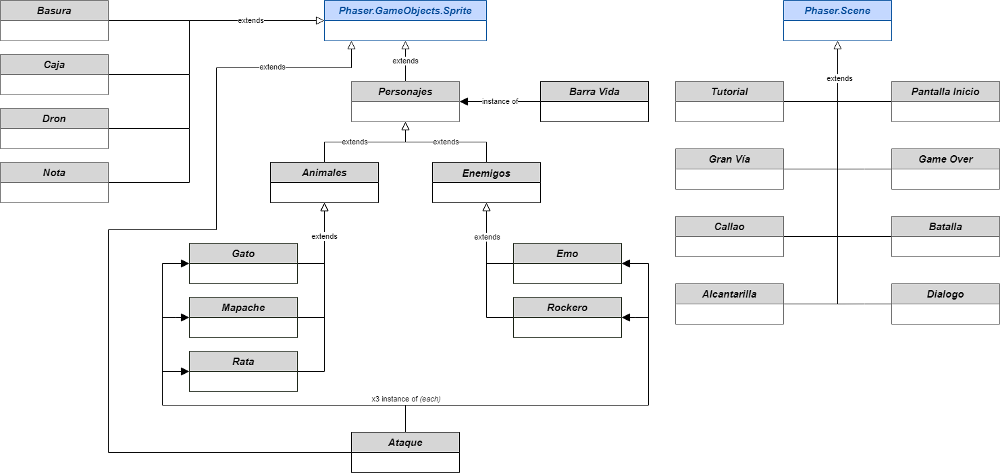

<h2>Sistema y plataforma de comunicación</h2>

Nos fuimos marcando objetivos semanales, a desarrollar durante las semanas del curso.

Para la comunicación fuera de las horas de laboratorio, principalmente trabajábamos de manera síncrona en un servidor de discord, donde nos compartimos tanto el arte como las tareas a realizar. Además hemos usado un grupo de Whatsapp específicamente creado para la asignatura, a modo de mandarnos recordatorios entre nosotros o avisos rápidos.

<h2>Informe de pruebas</h2>

Hemos pedido ayuda a unos 10 testers para que probasen nuestro juego. Por lo general, la reacción ha sido muy positiva, a todo el mundo le ha gustado la temática del juego así como la historia. 
En cuanto a la jugabilidad, hay quien se ha perdido un poco, bien por no prestar atención a la historia o bien por no fijarse hacia dónde tenía que avanzar. Son varios a quienes les gustaría que hubiese más animaciones en cuanto a los personajes jugables. También alguno ha pedido más feedback en los combates, como por ejemplo una mayor explicación de los ataques de cada animal. Por último, también cabe mencionar que deberíamos resaltar más qué es una plataforma en los mapas, puesto que algunas parece que se confunden con el fondo.

Como conclusión, el juego ha recibido una respuesta muy positiva dentro de un rango de edad de unos 17 años (de unos 18 a 35 años). Los errores que nos han dicho durante el testing son razonables y serán tenidos en cuenta para mejorar el juego en un futuro.

“Me siento como spiderman en gato”

